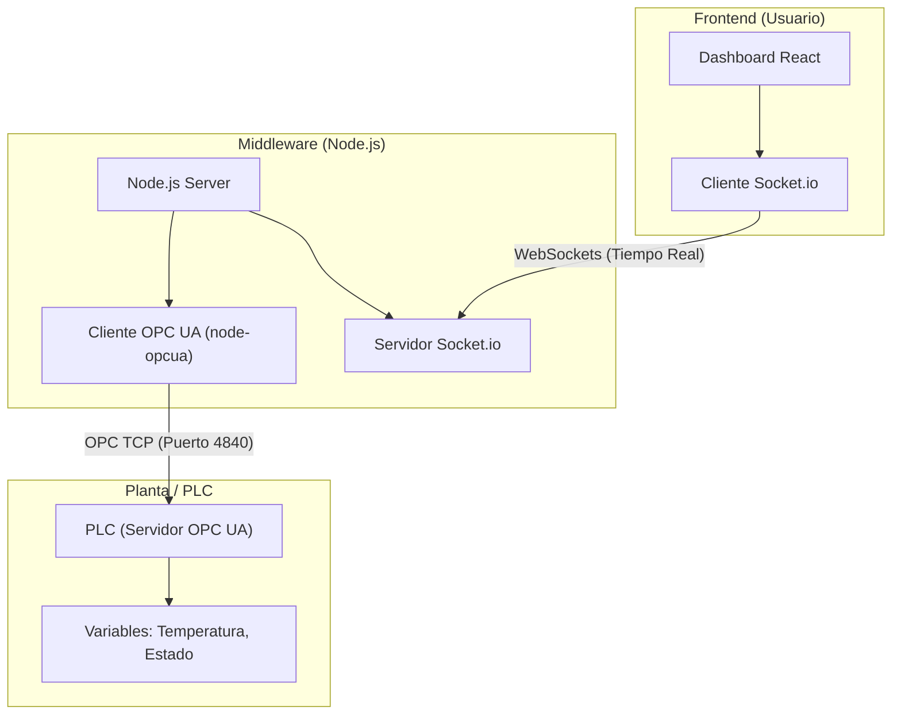

# Guía de Implementación OPC UA con Node.js

Esta guía detalla la arquitectura, librerías y metodología utilizada en este proyecto para establecer una comunicación robusta entre un PLC (Industrial) y un Frontend Web (React), utilizando Node.js como middleware.

## 1. Arquitectura del Sistema

El sistema actúa como una pasarela (Gateway) que traduce el protocolo industrial OPC UA a eventos WebSocket (Socket.io) consumibles por la web.



## 2. Librerías Disponibles y Selección

Para la implementación en Node.js, la librería estándar de facto es **node-opcua**.

### Librerías Principales
| Librería | Descripción | Uso en este proyecto |
|----------|-------------|----------------------|
| **node-opcua** | Implementación completa del stack OPC UA en TypeScript/JS. Soporta Cliente y Servidor. | **Sí (Core)**. Usada para conectar con el PLC. |
| **express** | Framework web rápido y minimalista. | **Sí**. Sirve la API y los estáticos si fuera necesario. |
| **socket.io** | Comunicación bidireccional en tiempo real. | **Sí**. Transporta los datos del PLC al Frontend. |

## 3. Implementación Actual (`index.js`)

El archivo `index.js` maneja la lógica de conexión y suscripción:

1.  **Conexión Resiliente**: Se configura una estrategia de reconexión agresiva para entornos industriales inestables.
2.  **Suscripción**: Se crea una suscripción OPC UA para recibir cambios de datos solo cuando ocurren (report by exception), ahorrando ancho de banda.
3.  **Mapeo de Datos**: Los datos recibidos del PLC se transforman (en este caso se simula un array de 500 puntos basado en la temperatura) y se emiten vía Socket.io.

## 4. Guía para Llamar Acciones del PLC (Escritura y Métodos)

Una de las capacidades más importantes es enviar comandos desde el Frontend al PLC (setpoints, marchas/paros, reset).

### A. Cambio de Frecuencia (Implementado)

Actualmente, el sistema permite cambiar la frecuencia de muestreo. Esto es un ejemplo de "escritura" o "configuración" desde el cliente web.

**Flujo:**
1.  **Frontend**: Emite evento `socket.emit('change-interval', 500)`.
2.  **Node.js**: Recibe el evento.
3.  **Lógica**:
    ```javascript
    socket.on('change-interval', (newInterval) => {
        // Modifica los parámetros del MonitoredItem en caliente
        globalMonitoredItem.modify(parameters, ...);
    });
    ```

### B. Implementar Nuevas Acciones (Ejemplo: Arrancar Motor)

Para añadir nuevas acciones (escrituras en el PLC), sigue este patrón:

#### 1. Identificar el NodeId
Debes conocer el NodeId de la variable en el PLC.
Ejemplo: `ns=3;s="DB_Control"."MotorStart"` (Booleano)

#### 2. Añadir el Listener en Node.js (`index.js`)

```javascript
// Dentro del bloque io.on('connection', ...)

socket.on('start-motor', async () => {
    console.log("Comando recibido: Arrancar Motor");
    
    if (!globalSession) {
        console.error("No hay sesión con el PLC");
        return;
    }

    const nodeToWrite = {
        nodeId: 'ns=3;s="DB_Control"."MotorStart"',
        attributeId: opcua.AttributeIds.Value,
        value: {
            value: { 
                dataType: opcua.DataType.Boolean, 
                value: true 
            }
        }
    };

    try {
        const statusCode = await globalSession.write(nodeToWrite);
        console.log("Escritura realizada, estado:", statusCode.name);
        
        // Confirmar al frontend
        socket.emit('action-result', { action: 'start-motor', success: statusCode.name === 'Good' });
        
    } catch (err) {
        console.error("Error escribiendo en PLC:", err);
    }
});
```

#### 3. Llamar desde el Frontend
```javascript
// En tu componente React
const handleStart = () => {
    socket.emit('start-motor');
};
```

### C. Llamar Métodos OPC UA (Call Method)

Si el PLC expone métodos (funciones complejas), usa `session.call()`:

```javascript
socket.on('reset-counter', async () => {
    const methodToCall = {
        objectId: "ns=3;s=\"Block_Methods\"", // Objeto padre
        methodId: "ns=3;s=\"Block_Methods\".\"Reset\"", // Método
        inputArguments: [] // Argumentos si los requiere
    };

    try {
        const result = await globalSession.call(methodToCall);
        console.log("Método ejecutado:", result.statusCode.name);
    } catch (err) { ... }
});
```

## 5. Resumen de Capacidades

-   **Lectura**: Suscripciones monitorizadas (`ClientMonitoredItem`).
-   **Escritura**: `session.write()` para cambiar setpoints o bits de control.
-   **Métodos**: `session.call()` para lógica compleja del lado del PLC.
-   **Seguridad**: Node-OPCUA soporta encriptación (Sign/SignAndEncrypt) y certificados, configurables en el cliente.
