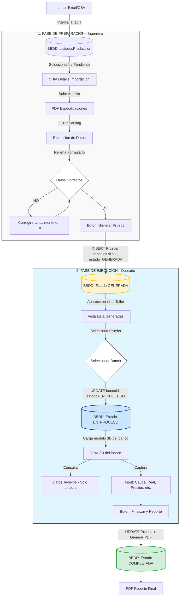

# Documentación del Flujo de Usuario - Plataforma IoT

Este documento describe el flujo operativo de la plataforma, detallando las interacciones entre los roles de Oficina (Ingeniería), Taller (Operarios) y la Vista 3D, junto con su correspondencia con la arquitectura del backend y la base de datos.

---

## Diagrama de Flujo



---

## Estados de una Prueba

| Estado | Descripción | bancoid | Responsable |
|--------|-------------|---------|-------------|
| `GENERADA` | Prueba definida, pendiente de asignar banco | NULL | Ingeniero |
| `EN_PROCESO` | Banco asignado, ejecución en curso | Asignado | Operario |
| `COMPLETADA` | Prueba finalizada, reporte generado | Asignado | Operario |

---

## Fase 1: Ingeniería (Oficina)

El objetivo de esta fase es convertir un registro crudo de importación en una Prueba formal lista para ejecución.

### 1.1 Importación de Datos
- El usuario sube un archivo Excel o CSV con las órdenes de trabajo.
- **Endpoint:** `POST /api/import-excel` o `POST /api/import-csv`
- **Base de Datos:** Se insertan registros en `ListadosProduccion`.

### 1.2 Selección y Enriquecimiento
- El ingeniero selecciona un registro de la lista de importación.
- Se visualizan los datos básicos (Cliente, Pedido, Modelo).
- Se adjunta un PDF con las especificaciones técnicas.

### 1.3 Extracción y Validación
- El sistema procesa el PDF (OCR/Parsing) para extraer parámetros:
  - Caudal, Altura, Potencia
  - Datos de bomba, motor, fluido
- El ingeniero valida y corrige los datos en un formulario.

### 1.4 Generación de Prueba
Al confirmar, se ejecuta la transición crítica:

- **Endpoint:** `POST /api/tests/create`
- **Operaciones en Base de Datos:**
  1. Crear registro en `prueba` con `estado = 'GENERADA'` y `bancoid = NULL`
  2. Crear registros relacionados en `bomba`, `motor`, `fluido`, `cliente`, `detalles`
  3. Guardar la ruta del PDF en `rutaPdfProtocolo`
  4. Opcionalmente marcar el registro de `ListadosProduccion` como procesado

---

## Fase 2: Ejecución (Taller)

El operario recibe una prueba ya definida y validada por ingeniería.

### 2.1 Selección de Prueba
- El operario ve la lista de pruebas con estado `GENERADA`.
- Selecciona una prueba para iniciar.

### 2.2 Asignación de Banco
Antes de acceder a la vista 3D, el sistema solicita:

- El operario selecciona el banco de pruebas a utilizar.
- **Endpoint:** `PUT /api/tests/:id/assign-banco`
- **Operación:** `UPDATE prueba SET bancoid = :bancoId, estado = 'EN_PROCESO'`

### 2.3 Vista 3D del Banco
- El sistema carga el modelo 3D correspondiente al banco seleccionado.
- Se muestran los datos teóricos extraídos del PDF como referencia.
- El operario captura los datos reales durante la ejecución.

### 2.4 Finalización
- Al completar la captura de datos, se finaliza la prueba.
- **Endpoint:** `PUT /api/tests/:id/complete`
- **Operaciones:**
  1. Guardar valores finales en `pruebaparametrovalor`
  2. Actualizar `estado = 'COMPLETADA'`
  3. Generar PDF de reporte final

---

## Endpoints API Requeridos

| Método | Endpoint | Descripción | Estado |
|--------|----------|-------------|--------|
| POST | `/api/import-excel` | Importar órdenes desde Excel | Implementado |
| POST | `/api/import-csv` | Importar órdenes desde CSV | Implementado |
| GET | `/api/tests` | Listar pruebas (pending + completed) | Implementado |
| GET | `/api/tests/:id` | Obtener detalle de prueba | Implementado |
| POST | `/api/tests/create` | Crear prueba desde listado | Pendiente |
| PUT | `/api/tests/:id/assign-banco` | Asignar banco a prueba | Pendiente |
| PUT | `/api/tests/:id/complete` | Finalizar prueba | Pendiente |
| GET | `/api/reports/:id` | Obtener reporte completo | Implementado |

---

## Modelo de Datos

### Tabla `prueba` (Modificaciones requeridas)

```sql
ALTER TABLE prueba ALTER COLUMN bancoid DROP NOT NULL;
ALTER TABLE prueba 
ADD COLUMN estado VARCHAR(20) DEFAULT 'GENERADA',
ADD COLUMN "rutaPdfProtocolo" VARCHAR(500),
ADD COLUMN "listadoId" INT;
```

### Relaciones

```
ListadosProduccion (1) ---> (0..1) prueba
prueba (1) ---> (1) bomba
prueba (1) ---> (1) motor
prueba (1) ---> (1) fluido
prueba (1) ---> (1) cliente
prueba (1) ---> (1) detalles
prueba (0..1) ---> (1) banco
```
