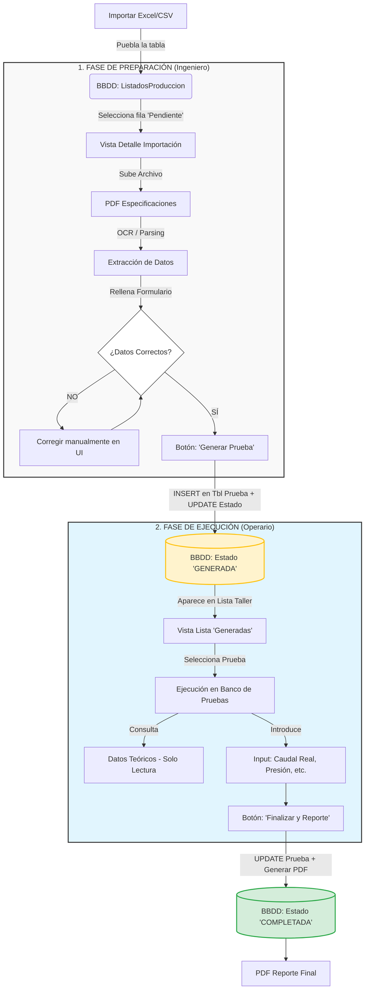

# Documentación del Flujo de Usuario - Plataforma IoT

Este documento describe el flujo operativo de la plataforma, detallando las interacciones entre los roles de Oficina (Ingeniería) y Taller (Operarios), y su correspondencia con la arquitectura del backend y la base de datos.

## Diagrama de Flujo

## Descripción Detallada del Flujo

### Inducción de Datos (Importación)
El proceso inicia con la carga masiva de órdenes de trabajo.
- **Acción:** El usuario sube un archivo Excel o CSV.
- **Backend:** Endpoint `POST /api/import-excel` o `POST /api/import-csv`.
- **Base de Datos:** Se eliminan los registros previos y se insertan nuevos en la tabla `ListadosProduccion`.
- **Estado:** Estos registros representan pruebas "Potenciales" o "Pendientes de Definición".

### Fase 1: Ingeniería (Oficina)
El objetivo de esta fase es convertir un registro crudo de importación en una `Prueba` definifa lista para ejecución.

1.  **Selección y Enriquecimiento:**
    - El ingeniero selecciona un registro de la lista de importación.
    - Se visualizan los datos básicos (Cliente, Pedido, Modelo).
    - Se adjunta un PDF con las especificaciones técnicas (Curvas, puntos de diseño).

2.  **Extracción y Validación:**
    - El sistema procesa el PDF (OCR/Parsing) para extraer parámetros críticos (Caudal, Altura, Potencia).
    - El ingeniero valida estos datos en un formulario, corrigiendo cualquier error de extracción.

3.  **Generación de Prueba (Transición Crítica):**
    - Al confirmar, se ejecuta la acción "Generar Prueba".
    - **Backend:** Se debe crear un nuevo endpoint `POST /api/tests/create`.
    - **Base de Datos:**
        - Se crea un registro en la tabla `prueba`.
        - Se crean los registros relacionados en `bomba`, `motor`, `fluido`, `detalles` y `cliente` utilizando los datos validados.
        - Se definen los puntos de prueba teóricos en `pruebaparametrovalor` (si aplica).
    - **Resultado:** La prueba pasa a estar disponible para el taller.

### Fase 2: Ejecución (Taller)
El operario recibe una prueba ya definida y validada.

1.  **Ejecución:**
    - El operario selecciona una prueba con estado 'GENERADA' de la lista.
    - El sistema muestra los datos teóricos (Solo lectura) para configurar el banco.
    - Se capturan los datos reales (automáticamente vía PLC o entrada manual según implementación).

2.  **Finalización:**
    - Al completar la toma de datos, se finaliza la prueba.
    - **Backend:** Endpoint `PUT /api/tests/:id/complete` (Pendiente de implementación).
    - **Base de Datos:** Se actualiza el registro en `prueba` (marcando fecha final o estado) y se guardan los valores finales.
    - **Reporte:** Se dispara la generación del informe PDF final certificado.

## Implicaciones Técnicas y Próximos Pasos (Backend)

Para soportar este flujo completo, se requiere extender la API actual:

1.  **Gestión de Estados:**
    - Actualmente la tabla `prueba` no tiene un campo explícito de "estado". Se debe evaluar añadir una columna `estado` (ENUM: 'GENERATED', 'IN_PROGRESS', 'COMPLETED') o inferirlo a partir de la presencia de resultados.

2.  **Creación Completa de Pruebas:**
    - Implementar la lógica transaccional para crear una `prueba` completa insertando simultáneamente en todas las tablas relacionadas (`bomba`, `motor`, etc.) desde el formulario de validación.

3.  **Captura de Resultados:**
    - Implementar los endpoints de escritura para `pruebaparametrovalor` y `pruebaparametrocontinuo` para guardar los datos generados durante la ejecución en taller.
