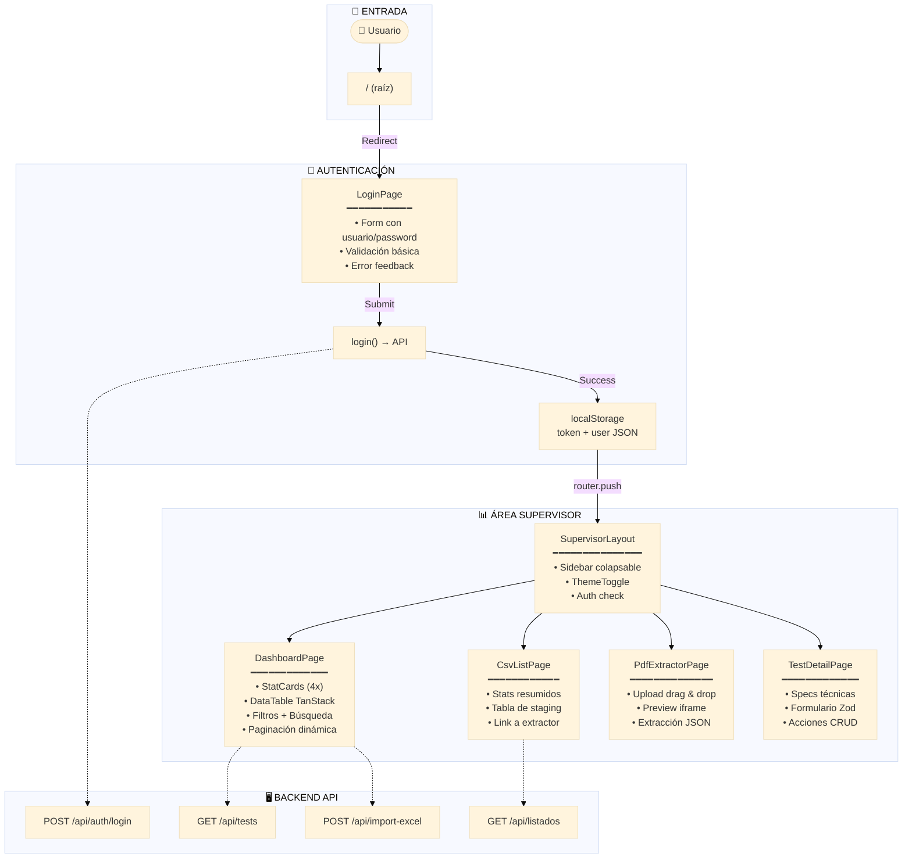
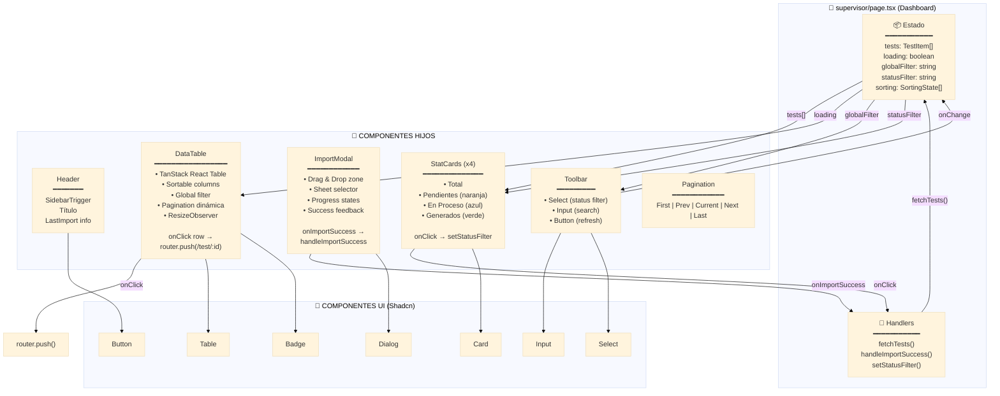
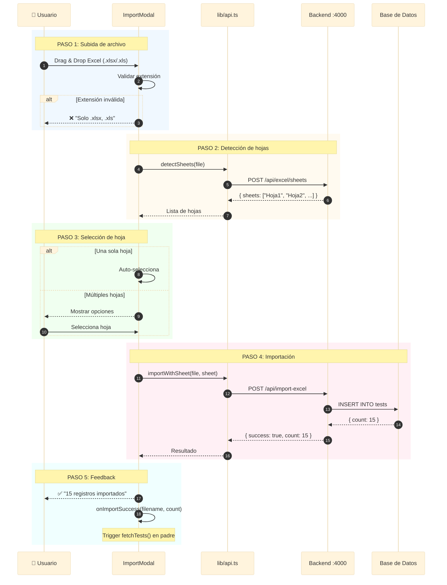
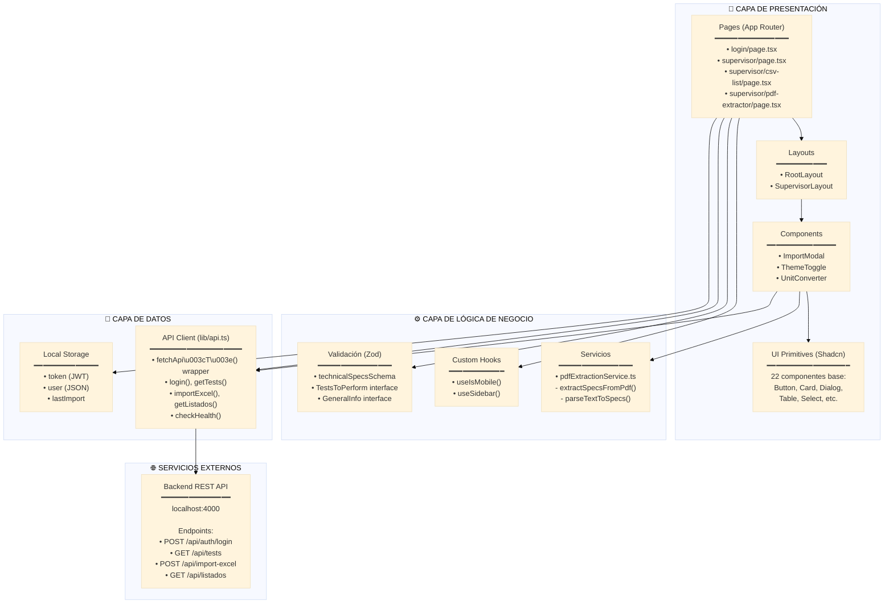

# Arquitectura del Proyecto - Pump IoT Platform (Frontend)

**Versión**: 1.1  
**Fecha**: 21 Enero 2026  
**Stack**: Next.js 16.1.1 + React 19 + TypeScript + Shadcn UI + Tailwind CSS 4

---

## 1. Resumen Ejecutivo

Este es el repositorio **frontend** de la plataforma de pruebas IoT para bombas industriales. Arquitectura de **microservicios**: frontend y backend operan como servicios independientes comunicándose vía REST API.

### Stack Tecnológico

| Tecnología | Versión | Propósito |
|------------|---------|-----------|
| Next.js | 16.1.1 | Framework SSR/SSG |
| React | 19.2.3 | UI Library |
| TypeScript | 5.x | Tipado estático |
| Tailwind CSS | 4.x | Utilidades CSS |
| Shadcn UI | latest | Componentes UI |
| Zod | 4.3.5 | Validación de schemas |
| TanStack Table | 8.21.3 | Tablas virtualizadas |
| pdfjs-dist | 5.4.530 | Extracción de PDFs |

---

## 2. Estructura del Proyecto

```
pump-iot-web/
├── src/
│   ├── app/                      # Next.js App Router (rutas)
│   │   ├── layout.tsx            # Layout raíz
│   │   ├── globals.css           # Sistema de diseño
│   │   ├── login/                # Autenticación
│   │   │   └── page.tsx          # Página de login (104 líneas)
│   │   └── supervisor/           # Área autenticada
│   │       ├── layout.tsx        # Layout con sidebar (146 líneas)
│   │       ├── page.tsx          # Dashboard principal (536 líneas)
│   │       ├── csv-list/         # Listados importados
│   │       │   └── page.tsx      # Vista de CSVs (138 líneas)
│   │       ├── pdf-extractor/    # Extracción de PDFs
│   │       │   └── page.tsx      # Extractor (204 líneas)
│   │       └── test/             # Detalles de pruebas
│   │           └── [id]/page.tsx # Vista de test individual
│   ├── components/
│   │   ├── ui/                   # 22 componentes Shadcn UI
│   │   ├── import-modal.tsx      # Modal de importación Excel (258 líneas)
│   │   └── theme-toggle.tsx      # Toggle dark/light mode
│   ├── lib/
│   │   ├── api.ts                # Cliente API centralizado (111 líneas)
│   │   ├── schemas.ts            # Schemas Zod (55 líneas)
│   │   ├── pdfExtractionService.ts # Extracción PDF (205 líneas)
│   │   └── utils.ts              # Utilidades (cn helper)
│   └── hooks/
│       └── use-mobile.ts         # Hook responsive (20 líneas)
├── public/                       # Assets estáticos
├── package.json
└── tsconfig.json
```

---

## 3. Diagramas de Arquitectura

### 3.1 Flujo de Usuario (Journey Map)



### 3.2 Comunicación de Componentes (Dashboard)



### 3.3 Flujo de Importación Excel



### 3.4 Arquitectura de Capas



---

## 4. Auditoría de Buenas Prácticas (Vercel React)

### 4.1 Reglas Cumplidas ✅

| Regla | Categoría | Estado | Evidencia |
|-------|-----------|--------|-----------|
| `rerender-memo` | Re-renders | ✅ | `useMemo` para columnas de tabla y datos filtrados |
| `rerender-functional-setstate` | Re-renders | ✅ | `setOpen((prev) => !prev)` en Sidebar |
| `rerender-lazy-state-init` | Re-renders | ✅ | useState con función en SidebarMenuSkeleton |
| `js-early-exit` | JavaScript | ✅ | Returns tempranos en handlers |
| `rendering-conditional-render` | Rendering | ✅ | Uso de ternarios para condicionales |
| `bundle-barrel-imports` | Bundle | ✅ | Imports directos, no barrel files |

### 4.2 Mejoras Recomendadas ⚠️

| Regla | Categoría | Estado | Recomendación |
|-------|-----------|--------|---------------|
| `bundle-dynamic-imports` | Bundle | ⚠️ | Importar dinámicamente componentes pesados como `pdfjs-dist` |
| `async-parallel` | Async | ⚠️ | Usar `Promise.all()` si hay múltiples fetches independientes |
| `server-cache-react` | Server | ⚠️ | Considerar React.cache() para data fetching en Server Components |
| `client-swr-dedup` | Client | ⚠️ | Considerar SWR para auto-deduplicación de requests |

### 4.3 Código de Ejemplo - Mejora Sugerida

```typescript
// ❌ Actual (carga síncrona de pdfjs)
import * as pdfjsLib from 'pdfjs-dist';

// ✅ Recomendado (carga dinámica)
const getPdfLib = async () => {
    const pdfjsLib = await import('pdfjs-dist');
    pdfjsLib.GlobalWorkerOptions.workerSrc = '/pdf.worker.min.mjs';
    return pdfjsLib;
};
```

---

## 5. Principios de Clean Code Aplicados

| Principio | Estado | Ejemplo |
|-----------|--------|---------|
| **SRP** (Single Responsibility) | ✅ | Cada componente hace una sola cosa |
| **DRY** (Don't Repeat Yourself) | ✅ | `fetchApi<T>` centraliza HTTP |
| **KISS** (Keep It Simple) | ✅ | Lógica directa, sin sobreingeniería |
| **Separation of Concerns** | ✅ | UI / Logic / Data en carpetas separadas |
| **Meaningful Names** | ✅ | `handleImportSuccess`, `technicalSpecsSchema` |
| **Small Functions** | ✅ | Funciones de 10-30 líneas promedio |
| **Comments for Why** | ⚠️ | Algunos TODOs pendientes |

---

## 6. Decisiones Arquitectónicas

### 6.1 ¿Por qué Next.js App Router?

- **File-based routing**: Rutas predecibles desde estructura de archivos
- **Server Components**: Optimización automática de bundle
- **Layouts anidados**: SupervisorLayout encapsula auth check

### 6.2 ¿Por qué Shadcn UI?

- **Código local**: 0% vendor lock-in (vs Telerik)
- **Radix primitives**: Accesibilidad WCAG 2.1 incluida
- **Customizable**: Puedes modificar cualquier componente

### 6.3 ¿Por qué Zod?

- **Zero dependencies**: Ideal para air-gapped
- **TypeScript-native**: Inferencia de tipos automática
- **Runtime validation**: Captura errores antes de enviar al backend

---

## 7. Issues Conocidos

| Issue | Severidad | Estado |
|-------|-----------|--------|
| PDF Worker carga desde CDN | 🔴 Alta | Ver [README_PDF_WORKER_FIX.md](./README_PDF_WORKER_FIX.md) |
| Sin tests automatizados | ⚠️ Media | Planificado |
| Console.log en lugar de logger | ⚠️ Media | Considerar pino |

---

## 8. Referencias

- [Next.js App Router Docs](https://nextjs.org/docs/app)
- [Shadcn UI Components](https://ui.shadcn.com)
- [Vercel React Best Practices](https://vercel.com/blog/how-we-optimized-react)
- [Zod Documentation](https://zod.dev)
